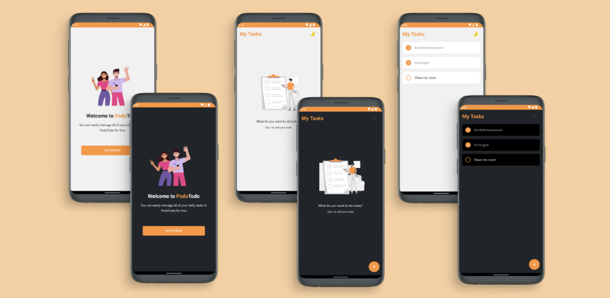

# PodoTodo - Todo Application


[](LICENSE)
[](https://github.com/RadiRS/rn-podotodo/actions/workflows/ci.yml)
[](https://github.com/RadiRS/rn-podotodo/actions/workflows/cd-android-prod.yml)
[](https://github.com/RadiRS/rn-podotodo/actions/workflows/ios-build.yml)

<p>&nbsp;</p>



This is a todo application built with React Native

## Getting Started

These instructions will get you a copy of the project up and running on your local machine for development and testing purposes. See deployment for notes on how to deploy the project on a live system.

### Prerequisites

- [Yarn (Package Manager)](https://yarnpkg.com)

- [Android Studio for Android Development](https://developer.android.com/studio)

- [XCode for iOS Development](https://developer.apple.com/xcode/)

### Installing

A step by step series of examples that tell you how to get a development env running

Clone the repository via http or ssh

```
git clone https://github.com/RadiRS/rn-podotodo.git your_app_name
```

```
git clone git@github.com:RadiRS/rn-podotodo.git your_app_name
```

Enter into project directory and install all dependencies

```
cd your_app_name && yarn
```

Run the project via command line

```
yarn android   //android
yarn ios       //ios
```

<p>&nbsp;</p>

## Running the tests

### Break down into end to end tests

Explain what these tests test and why.
For testing just run script command

```
yarn test
```

<p>&nbsp;</p>

## Deployment

### Android

Setup your signed apk by follow [this](https://facebook.github.io/react-native/docs/signed-apk-android) tutorial and run this command

```
yarn build-android
```

<p>&nbsp;</p>

## Built With

- [React Native](https://facebook.github.io/react-native) - Learn once, write anywhere.
- [React Navigation](https://reactnavigation.org) - Routing and navigation for your React Native apps.
- [Redux Toolkit](https://redux-toolkit.js.org) - The official, opinionated, batteries-included toolset for efficient Redux development.

<p>&nbsp;</p>

## Contributing

Please read [CONTRIBUTING.md](CONTRIBUTING.md) for details on our code of conduct, and the process for submitting pull requests to us.

<p>&nbsp;</p>

## Versioning

We use [SemVer](http://semver.org/) for versioning. For the versions available, see the [tags on this repository](https://github.com/RadiRS/rn-podotodo/tags).

<p>&nbsp;</p>

## Authors

- **Radi Rusadi** - _Initial work_ - [RadiRS](https://github.com/RadiRS)

See also the list of [contributors](https://github.com/RadiRS/rn-podotodo/contributors) who participated in this project.

<p>&nbsp;</p>

## License

This project is licensed under the MIT License - see the [LICENSE](LICENSE) file for details
